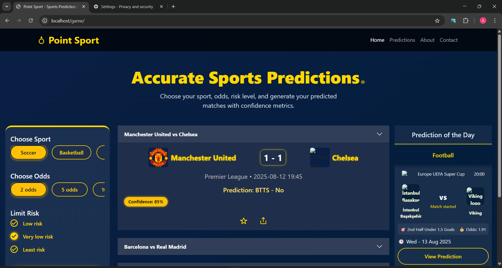
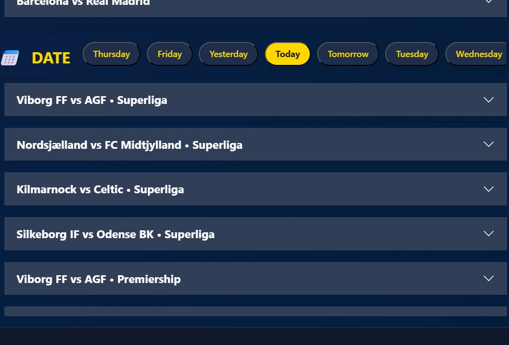
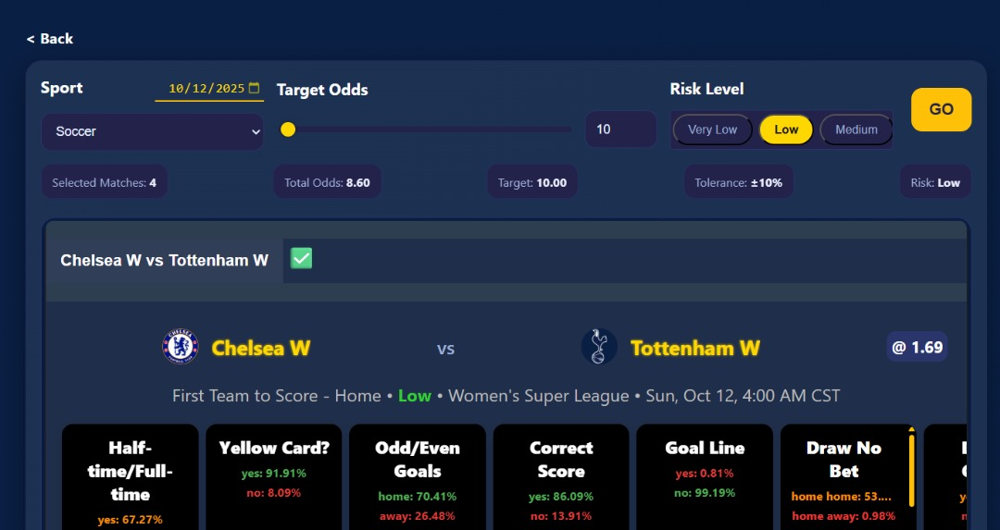

# 🏆 Sports Prediction Dashboard

A powerful, lightweight web application for generating, viewing, and exploring sports match predictions with confidence metrics, odds, and risk levels.  
Built with **HTML, CSS, JavaScript**, and a **PHP backend**, it integrates seamlessly with the **SportMonks API** for live fixtures and prediction data.

---

## 📌 Features

- 🔮 **Dynamic Match Predictions**  
  Generate predictions by sport, odds target, and risk level.

- 🗂 **History Explorer**  
  View previously generated predictions with match results.

- ⭐ **Favorites & Notes**  
  Save predictions and attach personal notes for later reference.

- 📱 **Responsive UI**  
  Optimized for mobile, tablet, and desktop.

- 🔌 **API Integration**  
  Live data from SportMonks API through a PHP-powered backend.

- 🎛 **Prediction Sliders & Metrics**  
  View confidence bars, xG, pressure levels, odds, and value bet indicators.

---

## 🧱 Project Structure

```
/project-root
 ┣ index.html                # Main prediction dashboard
 ┣ history.html              # History explorer
 ┣ custom.html               # Custom accumulator builder
 ┣ backend/
 │   ┣ t.php                 # Fetches daily fixtures & predictions
 │   ┣ getPreHistory.php     # Returns historical data
 │   ┣ all.php               # Odds & prediction metadata
 │   ┣ tkn.txt               # Store your API token here
 │   ┗ ... helper PHP scripts
 ┣ scripts/
 │   ┣ generate.js           # Prediction logic
 │   ┣ days.js               # Daily match rendering
 │   ┣ his.js                # History view logic
 │   ┗ ui.js                 # UI helpers (optional)
 ┣ styles/
 │   ┣ themes.css
 │   ┣ generate.css
 │   ┣ history.css
 │   ┗ global.css
 ┣ assets/
 │   ┣ logos/
 │   ┣ icons/
 │   ┗ screenshots/
 ┗ README.md                 # This file
```

---

## 🚀 Getting Started

### **1. Requirements**
- PHP 7.4+
- Local server: XAMPP, WAMP, Laragon
- SportMonks API token

### **2. Installation**
1. Clone the repository.
2. Place the project folder inside your web server directory:

   ```
   C:\xampp\htdocs\game
   ```

3. Add your **SportMonks API key** in:

   ```
   the backend folder in all .php files at the front of $apiToken variables
   ```

### **3. Run the Project**
1. Start Apache on XAMPP/WAMP.  
2. Open your browser:

   ```
   http://localhost/game/
   ```

---

## 🔗 API & Data Flow

### **SportMonks API**
Used to fetch:
- Live fixtures  
- Odds  
- Predictions  
- Historical match info

### **Backend Endpoints**
| File | Description |
|------|-------------|
| `backend/t.php` | Fetch daily fixtures + predictions |
| `backend/getPreHistory.php` | Fetch historical data |
| `backend/all.php` | Odds and prediction types |

---

## 🧩 Frontend Logic (Important Notes)

- **days.js**  
  Generates daily match list, sliders, prediction cards, explore toggles, date buttons.

- **his.js**  
  Renders historical predictions with collapsible cards and expandable metrics.

- **generate.js**  
  Handles accumulator logic, confidence math, markets, and UI rendering.

- The frontend expects responses shaped like:

```json
{
  "id": 123,
  "league": "Premier League",
  "home": "Chelsea",
  "away": "Arsenal",
  "homeLogo": "url",
  "awayLogo": "url",
  "kickoff": "2025-01-01 15:00",
  "predictions": [...],
  "odds": { "home": 1.90, "draw": 3.5, "away": 4.2 },
  "xg": 1.75,
  "pressure": 63,
  "value_bet": "Yes"
}
```

---

## 🛠 Customization

### **Add New Sports**
Edit in:

```
scripts/generate.js
```

### **Change UI Theme**
Modify:

```
styles/themes.css
```

### **Modify Prediction Logic**
Adjust confidence, accumulators, and value calculations in:

```
scripts/generate.js
```

### **Improve Rendering**
Update HTML templates inside:

```
scripts/days.js
scripts/his.js
```

---

## 🖼 Screenshots (Add Your Images Here)

Create a folder:

```
assets/screenshots/
```

## 📸 Screenshots

### Dashboard


### Daily Matches


### Mobile View


### Custom Prediction Page


---

## 🩺 Troubleshooting

| Issue | Solution |
|-------|----------|
| Blank page | Check browser console for JS errors |
| PHP not running | Ensure Apache+PHP is active in XAMPP |
| No fixtures | Check API token  `$apiToken` |
| Missing images | Verify paths in `/assets` |

---

## 🔧 Extending the Project

You can extend the project by:

- Adding more prediction markets  
- Storing user preferences (favorites, notes) in a DB  
- Creating a login system  
- Integrating machine learning models  
- Building a mobile version with React Native  

---

## 📄 License

This project is for **educational and demo purposes** only.  
Check individual files for third-party asset licenses.

---

## 💬 Contribute / Feedback

Love this project?  
- ⭐ Star it  
- 🍴 Fork it  
- 📝 Open an Issue with suggestions or questions


## 📬 Contact / Support

For feedback or contributions:  
- Open an issue  
- Submit a pull request  
- Or contact via the dashboard
- +2347066253101 (whatsapp only)